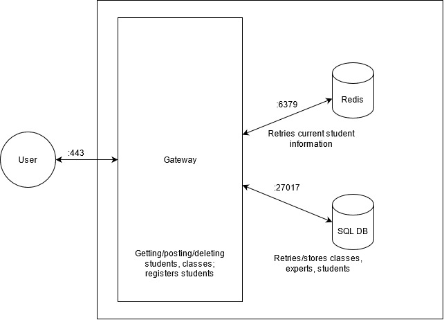

# iStudy Buddy
## Project Description
iStudy Buddy is an application that will be primarily used by UW students, where students can use to find study buddies 
to study with for specific classes. Our application allows students to register for the classes that they are in, allowing 
them to find other students who are also looking for people to study with for specific classes. If a student cannot find 
the class that they'd like to register for, they have the ability to create the class that they'd like to find study buddies for.
If a student feels that they are an expert in a certain class, they can register themselves as an expert for the class and 
open themselves up to helping or tutoring other students. Once the quarter is over or if a student decides to drop a 
class, they have the ability to unregister themselves from a class.

Students will benefit from using this application because they will be able to easily find other students to work with 
(especially during online school!). They will also be able to find other students who want to help as tutors. 

As developers, we built this application so that students can make more connections with each other and help
each other succeed in classes. This project can be expanded greatly and create a positive impact on the UW community.

## Technical Description
### Infrastructure
The system primarily uses Docker containers for our web client, api, storage, and session storage. Users interact with 
the web client, which will send requests to the api container. The request server will then send the appropriate 
registering / unregistering and sign up activities to the database container where students, classes, and student 
experts are kept track of. 

### Infrastructure Diagram


### Use cases and priority
| Priority    | User        | Description |
| ----------- | ----------- | ----------- |
| P0          | Student     | As a student, I want to view all available classes  and register for one |
| P0   | Student        | As a student, I want to see who is in my class and their applicable contact information |
| P1   | Expert        | As an  expert, I want toregister as an expert for a class to make my tutoring services available |

### API Design

`/students`:
- POST: Create a new user to the DB
    - `201; application/json`: Successfully creates a new user to the DB, returns encoded user
    - `415`: Cannot decode body, unsupported media type
    - `500`: Internal Serve Error

`/students/{id}`:
- GET: Get information about the student
    - `200; application/json`: Successfully returns basic information about the student 
    - `401`: User is not logged in and cannot retrieve information about the students 
    - `404`: invalid ID 
     - `415`: Cannot decode body, unsupported media type
    - `500`: Internal Serve Error
    
- PATCH: Update information about the student 
    - `200`: Successfully updates information for the user.
    - `401`: Cannot verify students session ID or no student session ID is provided.
    - `415`: Cannot decode body or receives unsupported body.
    - `500`: Internal server error.

`/students/{id}/classes`:
- GET: Get all classes the given user is registered for
    - `200; application/json`: returns all the 
    courses a given student is the enrolled in 
    - `401`: Cannot authenticate the provided credentials.
    - `500`: internal server error

`/students/{id}/expertise`:
- GET: Get all classes the given user is registered as an expert to
    - `200; application/json`: returns all the 
    courses a given student is the expert in 
    - `401`: Cannot authenticate the provided credentials.
    - `500`: internal server error

`/sessions/`:
- POST: Log in student and returns session cookie.
    - `200`; application/json: Successfully logs in a user; returns session ID in Authorization header as Bearer: ________.
    - `401`: Cannot authenticate the provided credentials.
    - `415`: Cannot decode body or receives unsupported body.
    - `500`: Internal server error.

- DELETE: Log out student.
    - `200`: Successfully logs out user
    - `401`: Cannot verify user session ID or no teacher session ID is provided.
    - `500`: Internal server error.
        
`/classes`:
- POST: Create and add a class to the DB
    - `201; application/json`: successfuly created and adds the class to the db 
    - `415`: mediatype is not supported
    - `400`: unable to decode, invalid couse
    - `500`: internal server error

- DELETE: Remove a class from the DB
    - `200`: successfully removed the course
    - `400`: student_id does not exist in the queue or has already been resolved.
    - `500`: Internal server error.
    
`/classes/{id}/people`:
- GET: Get profiles of all stdents registered in a class
    - `200`: successfully returns the students in the given course
    - `404`: no class found with the id or student unable to be decoded 

`/classes/{id}/experts`:
- GET: Get profiles of all experts registered to a class
    - `200`: successfully returns the experts in the given course
    - `404`: no class found with the id or student unable to be decoded 

`/register-class`:
- POST: Add currently authenticated student to a class roster
    - `201; application/json`
- DELETE: Remove currently authenticated student from the class roster
    - `200`

`/register-expert`:
- POST: Add currently authenticated student to class experts roster
    - `201; application/json`: successfully added to the course
    - `500` internal server error

- DELETE: Remove currently authenticated student the class roster 
    - `200`: successfully removed the course
    - `400`: student_id does not exist in the db or has already been resolved.
    - `500`: Internal server error.

### Models
We will be utilizing SQL DB as our persistent data store. We will be using Redis as our session storage to track who
is currently signed in. 

#### Students
`student`: Users will be represented in the database as follows. This is the model that will be returned when a 
client requests, creates, or updates any user.

``` 
{
    "id": "id_value",
	"email": "email_value",
    "passHash": "passhash_value",
	"userName": "username_value",
	"firstName": "firstname_value",
	"lastName": "lastname_value",
    "photoURL": "photourl_value",
	"major": "major_value",
    "phoneNumber": "phonenumber_value"
} 
```
`credentials` : Login credentials to be posted.

```
{
    "email": "email_value",
	"password": "password_value"
}
```
`newStudent`: The client will send this information to create a new account for the student.
```
{
	"email": "email_value",
    "password": "password_value"
    "passwordConf": "passwordconf_value",
	"userName": "username_value",
	"firstName": "firstname_value",
	"lastName": "lastname_value",
	"major": "major_value",
    "phoneNumber": "phonenumber_value"
}
```
`updates`: Updates to be applied to the student.
```
{
    "firstName": "firstname_value",
	"lastName": "lastname_value",
	"major": "major_value"
}
```
#### Class
`class`: Classes will be represented in the database as follows. This is the model that will be returned when a 
client requests, creates, or updates any class.
```
{
    "id": "id_value",
	"name": "name_value",
	"departmentName": "departmentname_value",
	"professorName": "professorname_value",
	"quarterName": "quartername_value"
}
```

`newClass`: The client will send this information to create a new class.
```
{
    "name": "name_value",
	"departmentName": "departmentname_value",
	"professorName": "professorname_value",
	"quarterName": "quartername_value"
}
```

`updates`: Updates to be applied to the class.
```
{
    "name": "name_value",
	"departmentName": "departmentname_value",
	"professorName": "professorname_value",
	"quarterName": "quartername_value"
}
```
#### CourseExperts
`courseExperts`: The client will send this to the server to save which experts are in which courses.
```
{
    "id": "id_value",
	"courseID": "courseid_value",
	"expertID": "expertid_value"
}
```
#### StudentCourses
`studentCourses`: The client will send this to the server to save which students are in which courses.
```
{
    "id": "id_value",
	"studentID": studentid_value",
	"courseID": "courseid_value"
}
```

